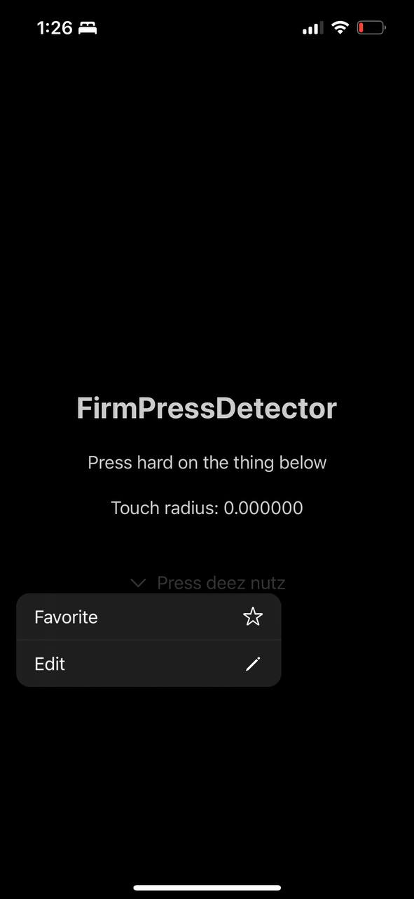

  <h5 align='center'>ABOUT</h5>
  

    Bringing 3D touch back to iOS devices by learning finger sizes
  

  
  
  

  

## Attributions

[PatrikTheDev](https://twitter.com/PatrikTheDev) for being a legend and helping me out a ton (practically built the whole demo) with SwiftUI and UIKit.
